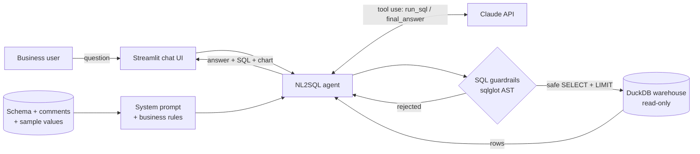
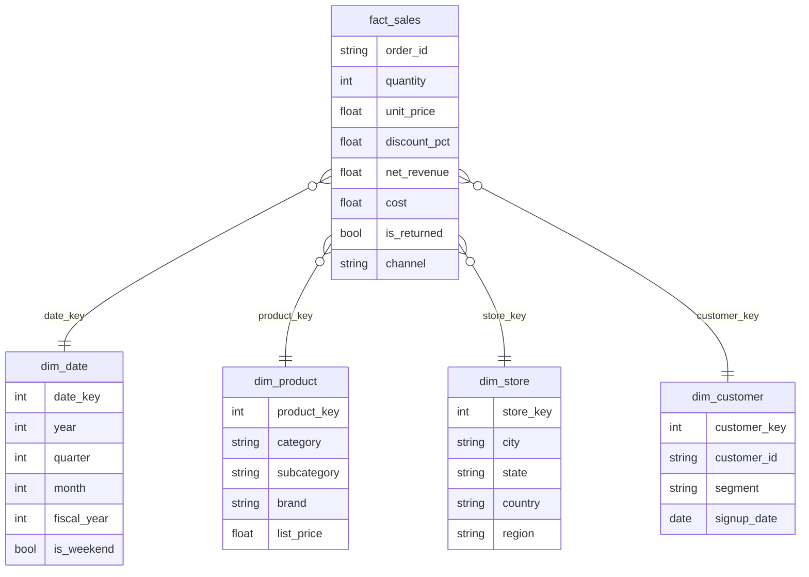

# NL-to-SQL Analytics Agent

**Ask a sales warehouse business questions in plain English and get back validated, read-only SQL, an answer and a chart.**

[](https://github.com/Shashan4321/nl-to-sql-analytics-agent/actions/workflows/ci.yml)


### ▶️ [Try the live demo](https://shashan4321.github.io/nl-to-sql-demo/): runs in your browser, no sign-up, no API key

The demo loads the same seeded warehouse, guardrails and evaluation set: pick any of the 32 business
questions, or try to break the guardrails with `DROP`, `DELETE` or file-read attacks. It runs on
Pyodide (Python in WebAssembly), which ships SQLite rather than DuckDB, so validated SQL is transpiled
with sqlglot; `tests/test_browser.py` proves all 32 gold queries return identical results on both engines.
Free-form English questions need Claude, so they run in the full app below.

> **Business problem.** Sales, finance and ops managers wait days for analysts to answer simple questions like *"Which category grew fastest this year?"*. This agent lets them ask directly, while keeping the database safe: it can only read, never write.

| | |
|---|---|
| **Stack** | Python · Claude API (tool use) · DuckDB (Postgres-compatible SQL) · sqlglot · Streamlit · Plotly · pytest · GitHub Actions |
| **Skills shown** | LLM agents · prompt engineering · schema-aware prompting · SQL guardrails · LLM evaluation · star-schema modelling · testing & CI |
| **Data** | Synthetic retail star schema, generated from a fixed seed (see [Data & license](#data--license)) |

---

## What it does

```text
You:    Which category grew fastest in revenue from 2024 to 2025?
Agent:  → writes SQL → guardrails check it → runs it read-only → reads the result
        → answers in plain English + chart + shows the SQL it used
```

* **Schema-aware prompting.** The prompt is built from the live warehouse: tables, columns, comments and sample values for low-cardinality columns (so the model writes `category = 'Electronics'` instead of guessing).
* **Business definitions in the prompt.** Revenue excludes returns, orders are `COUNT(DISTINCT order_id)`, FY is Indian April-March. This keeps answers consistent with how finance defines KPIs.
* **Tool use with self-correction.** Claude calls `run_sql`. If the query fails, the error is sent back and Claude fixes it, up to 5 steps.
* **Read-only guardrails** ([`guardrails.py`](src/nl2sql/guardrails.py)). Queries are parsed into a syntax tree with sqlglot, not matched with regex:
  * a single statement only; must be `SELECT` / `WITH` / `UNION`
  * no `INSERT/UPDATE/DELETE/DROP/ALTER/COPY/ATTACH/PRAGMA` anywhere in the tree
  * table allow-list; file and network functions (`read_csv`, `glob`...) blocked
  * `LIMIT` added automatically if missing
  * and the connection itself is opened `read_only=True` with external access disabled
* **Evaluation set.** [`evals/questions.yaml`](evals/questions.yaml) has **32 question → gold SQL pairs** (easy / medium / hard: YoY growth, running totals, top-N per group, Pareto 80/20, FY logic) plus 2 destructive requests that must be refused. Scoring is *execution accuracy*: the agent's result set must match the gold result set.

## Architecture



### Data model (star schema)



## In this project

Numbers below are computed from the generated data and the test suite; rerun `make data test eval-gold` to reproduce them.

| Metric | Value |
|---|---|
| Order lines in `fact_sales` | 60,151 (30,000 orders) |
| Customers / products / stores | 4,000 / 168 / 27 across India, UAE, Singapore |
| Period | Jan 2023 to Dec 2025 (1,096 days) |
| Evaluation questions | 32 gold SQL pairs + 2 refusal cases (all 32 gold queries validated in CI) |
| Unit tests | 66 (guardrails, agent loop with a scripted fake LLM, result matching, DuckDB vs SQLite parity for the browser demo) |
| Agent execution accuracy | Run `make eval` with your API key; results are written to `evals/REPORT.md`. |

## Quick start

```bash
git clone https://github.com/Shashan4321/nl-to-sql-analytics-agent.git
cd nl-to-sql-analytics-agent
python -m venv .venv && source .venv/bin/activate
pip install -r requirements-dev.txt
cp .env.example .env              # add your ANTHROPIC_API_KEY
make data                         # builds data/warehouse.duckdb (seeded)
make test                         # 66 tests, no API key needed
make app                          # opens the Streamlit UI
make eval                         # scores the agent on the 34-case eval set
```

**Browser demo (no key):** [shashan4321.github.io/nl-to-sql-demo](https://shashan4321.github.io/nl-to-sql-demo/), source in `demo/`.
**Full app with Claude:** deploy `app.py` on [Streamlit Community Cloud](https://streamlit.io/cloud) and add `ANTHROPIC_API_KEY` under *Settings → Secrets*. The warehouse builds itself on first run.

## Project structure

```text
nl-to-sql-analytics-agent/
├── app.py                    # Streamlit chat UI
├── src/nl2sql/
│   ├── warehouse.py          # seeded synthetic star schema -> DuckDB
│   ├── db.py                 # schema prompt builder + read-only execution
│   ├── guardrails.py         # AST-based SQL validation
│   ├── agent.py              # Claude tool-use loop with self-correction
│   ├── charts.py             # picks bar / line / pie / KPI
│   └── evaluate.py           # execution-accuracy harness -> evals/REPORT.md
├── evals/questions.yaml      # 32 gold question/SQL pairs + 2 refusal cases
├── tests/                    # pytest, runs offline with a fake LLM client
├── .github/workflows/ci.yml  # ruff + pytest + gold SQL validation
└── Makefile
```

## Design decisions

| Decision | Why |
|---|---|
| DuckDB for the demo | Runs anywhere (laptop, CI, Streamlit Cloud) with no server. The SQL is ANSI/Postgres-style; pointing `Warehouse` at Postgres or Snowflake means swapping the connection. |
| AST guardrails + read-only connection | Two independent layers. Prompt instructions alone are not a security control. |
| Execution accuracy, not string match | Two different SQL queries can both be correct. Comparing result sets is what matters to the business user. |
| `temperature=0` + prompt caching | Repeatable answers; the long schema prompt is cached to cut latency and cost. |
| Business rules in the prompt | "Revenue" must mean the same thing as in the finance dashboard. |

## Roadmap

- [ ] Postgres and Snowflake connectors (same guardrails, dialect switch)
- [ ] Few-shot retrieval: pull the 3 most similar eval questions into the prompt
- [ ] Semantic layer (metric definitions in YAML) instead of free-text rules
- [ ] Answer caching for repeated questions

## Data & license

* **Data:** 100% synthetic, generated by [`warehouse.py`](src/nl2sql/warehouse.py) with NumPy (seed 42). Store, product and customer names are invented. No employer or client data, schema or code is used.
* **Code:** MIT License.

## Author

**Shashank Singh**, Senior Data Analyst (Power BI · Microsoft Fabric · Snowflake · SQL · Python · GenAI)
[Portfolio](https://shashan4321.github.io) · [LinkedIn](https://www.linkedin.com/in/shashank-moon) · [GitHub](https://github.com/Shashan4321)

*Professional impact:* I built an NL-to-SQL system at work so non-technical stakeholders could query data in plain English. This repo rebuilds the idea from scratch on public-safe synthetic data.
